  

# Testing documentation for FlavourVault Web application.
  

# Validation

## HTML Validation

All pages pass HTML Validation at [W3C markup validation service](https://validator.w3.org/)

Home page

 

Recipes page 

 
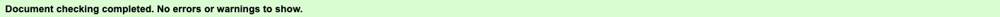

Recipes detail page

 
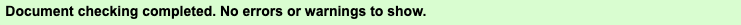

Account page

 
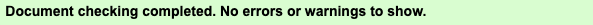

Log In

 
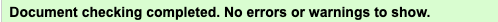

Sign Up

 
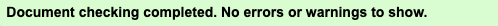

Create recipe page

 
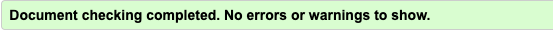

Edit recipe page

 
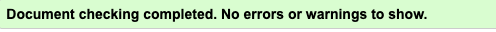

Log Out page

 
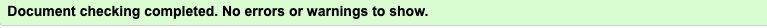

  

## JavaScript Validation

Custom JavaScript file run through [JShint](https://jshint.com/) for validation

JavaScript Validation

 
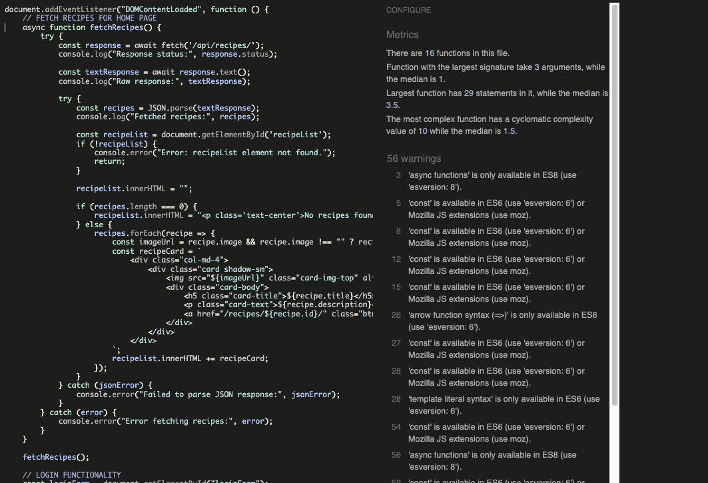

  

## CI Python Linter

All python files run through CI PEP8 Linter

Models.py

 
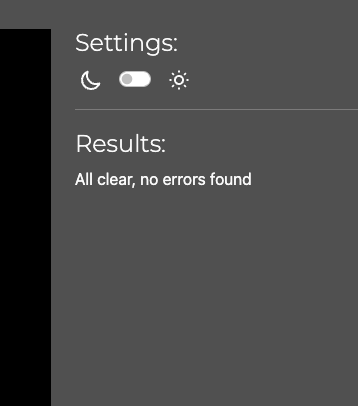

views.py

 
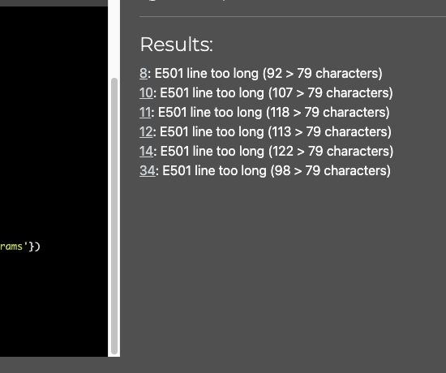

serializers.py

 
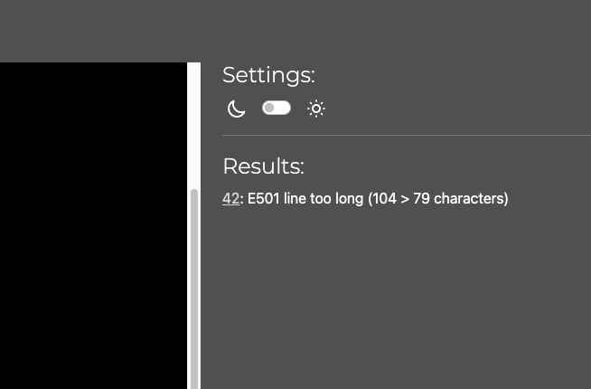

forms.py

 
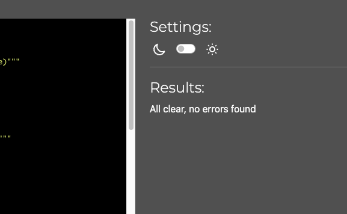

  