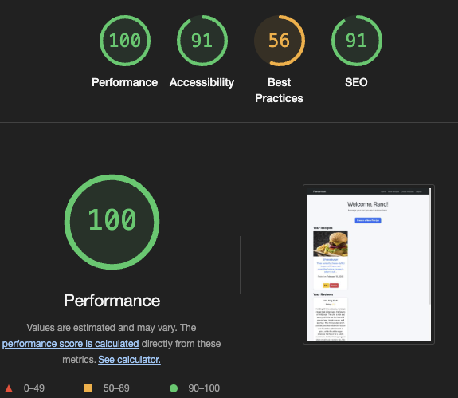

  

# Testing documentation for FlavourVault Web application.
  

# Contents

* [Validation](#validation)
    * [HTML Validation](#html-validation)
    * [JavaScript Validation](#javascript-validation)
    * [CI Python Linter](#ci-python-linter)
    * [Lighthouse](#lighthouse)
* [User Story Testing](#user-story-testing)
    * [General](#general)
    * [Logged Out](#logged-out)
    * [Logged In User](#logged-in-user)
    * [Admin](#admin)
* [Manual Testing](#manual-testing)

  
# Validation

## HTML Validation

All pages pass HTML Validation at [W3C markup validation service](https://validator.w3.org/)

Home page

 

Recipes page 

 

Recipes detail page

 

Account page

 

Log In

 

Sign Up

 

Create recipe page

 

Edit recipe page

 

Log Out page

 

  

## JavaScript Validation

Custom JavaScript file run through [JShint](https://jshint.com/) for validation

JavaScript Validation

 

  

## CI Python Linter

All python files run through CI PEP8 Linter

Models.py

 

views.py

 

serializers.py

 

forms.py

 

  

## Lighthouse

### Desktop

Home page

 

Recipes page

 

Recipe detail page

 

Log in page

 

Sign up page

 

Account page

 

Create recipe page

 

Edit recipe page

 

Log out page

 

  

### Mobile

Home page

 

Recipes page

 

Recipe detail page

 

Log in page

 

Sign up page

 
>

Account page

 

Create recipe page

 

Edit recipe page

 

Log out page

 

  

# User Story Testing

## General

| User Story                                                                                | Feature                                                                                                                                    |
| ----------------------------------------------------------------------------------------- | ------------------------------------------------------------------------------------------------------------------------------------------ |
| I want to immediately identify the purpose of the site.                                   | Logo in header displaying app name, and the homepage featuring a welcome message and call-to-action buttons.                             |
| I want navigation to be simple and intuitive.                                             | Nav links follow standard conventions of right-aligned links and a common hamburger icon for mobile devices. Links differ depending on user level. |
| I want to be able to view the site on any device.                                         | Site is fully responsive with the aid of the Bootstrap framework’s grid system.                                                               |

  

## Logged Out 

| User Story                                        | Feature                                                                    |
| ------------------------------------------------- | -------------------------------------------------------------------------- |
| I want to be able to log in/signup to the service. | Both login and register features available, CTA on homepage or in navbar. |

  

## Logged In User

| User Story                                                                      | Feature                                                                                                               |
| ------------------------------------------------------------------------------- | --------------------------------------------------------------------------------------------------------------------- |
| I want to be able to create and manage my recipes.                                | Create and manage recipes on the account page. Recipes can be edited and deleted. |
| I want to be able to review recipes posted by other users.                       | Review feature available on the recipe detail page. Rating and comment functionality with validation for multiple reviews. |

  

## Admin

| User Story                                                                           | Feature                                                                                                                                                        |
| ------------------------------------------------------------------------------------ | -------------------------------------------------------------------------------------------------------------------------------------------------------------- |
| I want to be able to manage all user accounts.                                      | Admin panel displays all users with options to edit or delete.                                                                                              |
| I want to be able to add or delete recipe categories.                                | Admin can manage recipe categories via a page that shows all categories with add and delete functionality.                                                     |
| I want to be able to manage all uploaded media, including recipe images.             | Admin can access all media items uploaded to Cloudinary and manage them appropriately.                                                                        |
| I want to be able to monitor user reviews and delete inappropriate ones.             | Admin can see reviews left by users and delete any inappropriate or invalid reviews.                                                                          |
| I want to be able to manage user roles such as making certain users Admin.           | Admin can assign or update user roles to control their permissions on the platform.                                                                            |

  

# Manual Testing

| Feature/Test                                        | Expected Outcome                                                                 | Result |
| --------------------------------------------------- | ------------------------------------------------------------------------------- | ------ |
| Logo in Navbar.                                    | Redirects to Homepage.                                                         | Pass   |
| Nav Links.                                         | Redirect to relevant pages.                                                     | Pass   |
| Responsive Navigation                              | Navbar collapses to a mobile-friendly menu with correct links.                  | Pass   |
| Footer Links                                      | Open relevant external sites in new tabs.                                      | Pass   |
| CTA Login Button on Homepage                      | Redirects to login page.                                                       | Pass   |
| Login Form - Empty                                | Will not submit if fields are empty.                                           | Pass   |
| Login Form - Incorrect Username                   | Form submits but does not log in, displays flash message with reason.           | Pass   |
| Login Form - Incorrect Password                   | Form submits but does not log in, displays flash message with reason.           | Pass   |
| Login Form - Correct Details                      | Form submits and redirects user to the dashboard.                              | Pass   |
| Register Link on Login Form                       | Redirects to Register page.                                                    | Pass   |
| Register Form - Empty                             | Will not submit if fields are empty.                                           | Pass   |
| Register Form - Username Exists                   | Form submits but does not register user, flash message displays username taken. | Pass   |
| Register Form - New User Details                  | Form submits, creates account, and redirects to Homepage with login prompt.    | Pass   |
| Log In Link on Register Form                      | Redirects to Login page.                                                       | Pass   |
| Log Out Button                                   | Logs user out, clears session, and redirects to Homepage.                      | Pass   |
| Recipe Submission - Empty Form                    | Will not submit if fields are empty.                                           | Pass   |
| Recipe Submission - Valid Details                 | Recipe is created and appears on the Recipes page.                             | Pass   |
| Edit Recipe - Access Own Recipe                   | Allows user to modify their own recipes.                                       | Pass   |
| Edit Recipe - Attempt to Edit Another User’s Recipe | Redirects to Homepage with "Not Authorized" message.                           | Pass   |
| Delete Recipe - Own Recipe                        | Prompts confirmation and deletes the recipe upon confirmation.                 | Pass   |
| Delete Recipe - Another User’s Recipe             | Redirects to Homepage with "Not Authorized" message.                           | Pass   |
| Recipe Detail Page                                | Displays full details of the recipe.                                          | Pass   |
| Review Form - Empty                               | Will not submit if fields are empty.                                           | Pass   |
| Review Form - Valid Input                         | Submits review and updates recipe reviews section.                            | Pass   |
| Review - Multiple Reviews per User Restriction    | Prevents users from reviewing the same recipe more than once.                 | Pass   |
| Admin Panel - Manage Users                        | Allows admin to view and delete users.                                        | Pass   |
| Admin Panel - Manage Recipes                      | Allows admin to delete any recipe.                                            | Pass   |
| Admin Panel - Manage Reviews                      | Allows admin to delete inappropriate reviews.                                 | Pass   |
| Unauthorized Access to Admin Page                 | Redirects to Homepage with "Not Authorized" message.                          | Pass   |